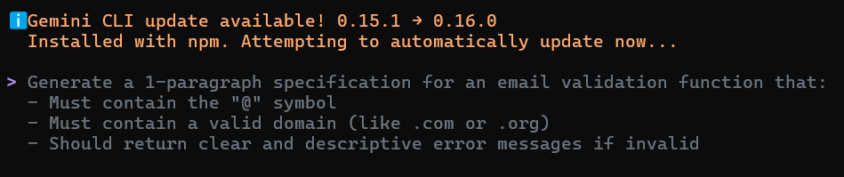
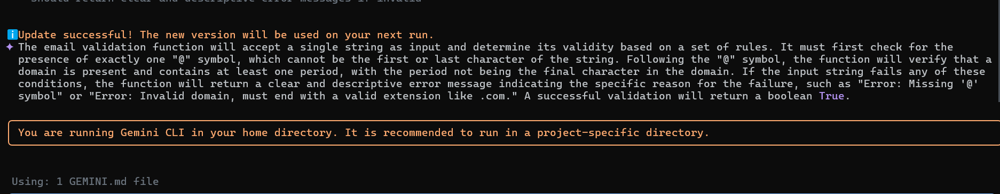

# 🧠 AIDD 30-Day Challenge — Task 2

# 📁Part A — Theory (Short Questions)

## 1. Nine Pillars Understanding 

### Q1. AI Development Agents (jaise Gemini CLI) ko repetitive setup tasks ke liye use karna system architect ki growth ke liye kyu behtar hai?

AI Development Agents jaise Gemini CLI ko repetitive setup tasks ke liye use karna system architect ki growth ke liye isliye behtar hai kyunki yeh unhe zyada strategic aur high-level tasks par focus karne ka mauka deta hai. Jab AI agents repetitive aur tasks ko handle karte hain, to system architects apni creativity, problem-solving skills, aur architectural design par zyada dhyan de sakte hain.

### Q2. Nine Pillars of AIDD ek developer ko M-Shaped Developer banne me kaise help karte hain?

AIDD ke 9 pillars developer ko sirf coding se utha kar system-level soch, design, aur architecture tak le jaate hain.
AI repetitive kaam sambhal leta hai, aur developer specs likhne, system design, quality gates, documentation, aur production-ready thinking par focus karta hai.

Is tarah developer ke paas breadth (multiple skills) + depth (deep expertise) dono aati hain — jis se woh M-Shaped Developer ban jata hai.

---

## 2. Vibe Coding vs Specification-Driven Development

### Q1.  Vibe Coding aam tor par ek haftay ke baad problems kyun create karta hai?

Vibe Coding aam tor par ek haftay ke baad problems create karta hai kyunki is approach me developers bina proper planning aur specifications ke code likhte hain. Jab code ko turant likha jata hai bina soch-vichar ke, to usme structure, scalability, aur maintainability ki kami ho sakti hai. Jaise-jaise project bada hota hai, yeh chhoti-chhoti problems milkar bade issues ban jati hain, jise samajhna aur fix karna mushkil ho jata hai.

### Q2. Specification-Driven Development un problems ko kaise prevent karta hai?

Specification-Driven Development un problems ko prevent karta hai kyunki pehle clear specs aur requirements define ki jati hain. Is se code organized, scalable, aur maintainable banta hai, aur project me changes aur updates easily manage ho jate hain.

Developers ko pata hota hai ki unhe kya build karna hai aur kaise, jisse long-term me issues kam hote hain aur project smooth chalti hai.

---

## 3. Architecture Thinking

### Q1. Architecture-first thinking AIDD me developer ka role kaise change karta hai?

Architecture-first thinking AIDD me developer ka role is tarah change karta hai ki developer sirf code likhne wala nahi rehta, balki system architecture ban jata hai. Developer ko ab poore system ke design, structure, aur architecture par dhyan dena hota hai.

### Q2. Developers ko raw code ke bajaye layers aur systems me kyun sochna chahiye?

Developers ko raw code ke bajaye layers aur systems me isliye sochna chahiye kyunki yeh approach unhe poore system ko samajhne aur design karne me madad karti hai. Jab developers layers aur systems par focus karte hain, to woh modular, scalable, aur maintainable solutions bana pate hain.

---

# 📁 Part B — Practical Task (Screenshot Required)

### Prompt:
   

---

### Response:
   

---

# 📁Part C — Multiple Choice Questions

1. What is the main purpose of Spec-Driven Development?  
- A. Make coding faster  
**B. Clear requirements before coding begins**  
- C. Remove developers  
- D. Avoid documentation  

2. What is the biggest mindset shift in AI-Driven Development?  
- A. Writing more code manually  
**B. Thinking in systems and clear instructions**  
- C. Memorizing more syntax  
- D. Working without any tools  

3. Biggest failure of Vibe Coding?  
- A. AI stops responding  
**B. Architecture becomes hard to extend**  
- C. Code runs slow  
- D. Fewer comments written  

4. Main advantage of using AI CLI agents (like Gemini CLI)?  
- A. They replace the developer completely  
**B. Handle repetitive tasks so dev focuses on design & problem-solving**  
- C. Make coding faster but less reliable  
- D. Make coding optional  

5. What defines an M-Shaped Developer?  
- A. Knows little about everything  
- B. Deep in only one field  
**C. Deep skills in multiple related domains**  
- D. Works without AI tools  
