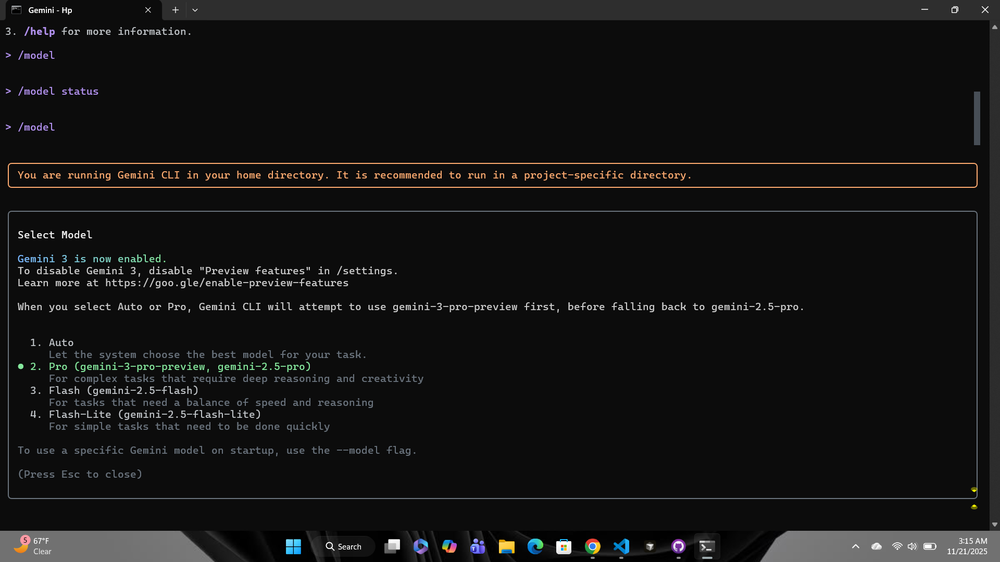

# 🧠 AI-Driven Development - 30-Day Challenge - Task 3

#  🌟 PART A — Research Questions

### Q1. What are the new improvements introduced in Gemini 3.0?

- **Deep Think Mode:** A new advanced reasoning mode to enhance the ability of logical thinking, problem-solving, and handling complex tasks.

- **Massive Context Window:** Support up to 1 million tokens and thereby enable the model to handle very long documents, chats, codebases among other things.

- **Improved Multimodal Intelligence:** Much better understanding of images, videos, documents, and spatail data.

- **Stronger Long-Horizon Planning:** Can plan and execute mutli-step workflows more reliably.

- **Better Coding Abilities:** Stronger tool use, terminal actions, and agentic coding for autonomous development tasks.

- **More Useful, Less Flattery Response:** "Sycophancy". gives straightforward factual response rather than just agreeable ones.

- **Improved Safety:** Stronger protection against misuse and prompt injection attacks.

---

### Q2. How does Gemini 3.0 improve coding & automation workflows?

- **Agentic Coding:** Automatically plans, writes, tests, and fixes code.

- **Strong Tool Usage:** Runs terminal commands and multi-step tasks with consistency.

-  **Vibe Coding:** Full Apps, UI, and Functional Code from Simple Natural-Language Prompts.

- **Multistep Automation:** Handles extended workflows without losing context.

- **Integration with developer tools:** It works with Gemini CLI, Antigravity, AI Studio, and Vertex AI for smooth automation.

---

### Q3. How does Gemini 3.0 improve multimodal understanding?

- **Multimodal Inputs:** Understands text, images, videos, PDFs and 3D data jointly.

- **Visual & Spatial Ability:** Can interpret layouts, trajectories, and spatial relationships.

- **Document Understanding:** Reads and reasons about tables, graphs, and structured content, beyond simple OCR.

- **High Benchmark Performance:** State-of-the-art results in multimodal reasoning benchmark tasks such as MMMU-Pro and Video-MMU.

- **Fine-Grained Control:** One can tune fidelity vs. speed for visual and multimodal tasks.

---

### Q4. How does Gemini 3.0 improve multimodal understanding?

- **Google Antigravity:** A completely new "agentic" IDE (Integrated Development Environment) designed for Gemini 3.0. Instead of just autocomplete, it allows you to manage AI agents that can autonomously plan and execute complex coding tasks across your editor, terminal, and browser.

 - **Gemini CLI (Command Line Interface):** An updated terminal tool that brings Gemini 3.0 directly to your command line. It allows you to generate complex shell commands using natural language (e.g., "find the commit that broke my dark mode") and can parse dense technical output into human-readable explanations.

 ---

 # 🌟 PART B — Practical Task (Screenshot Required)

- Using the /model command in Gemini CLI, update the Gemini model to the latest version
(3.0).

### GEMINI CLI MODEL:

