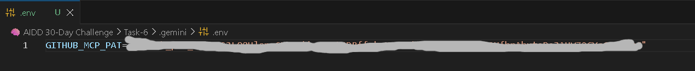
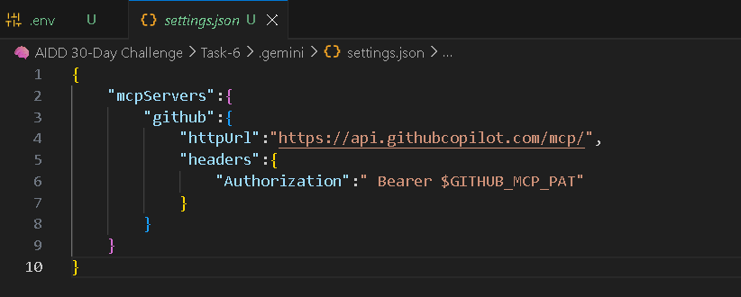
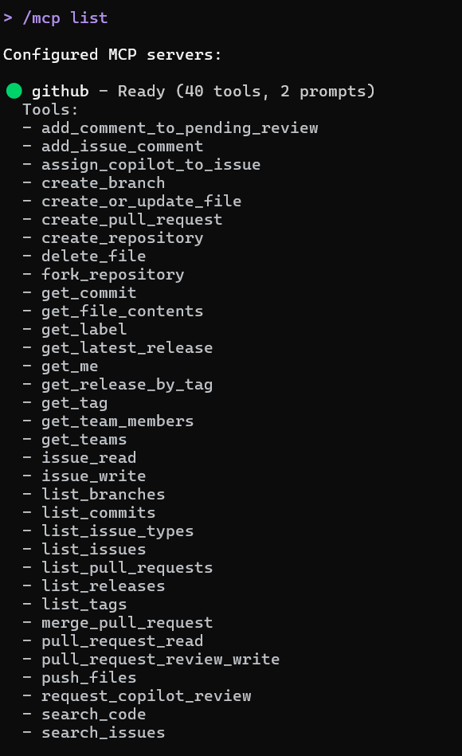
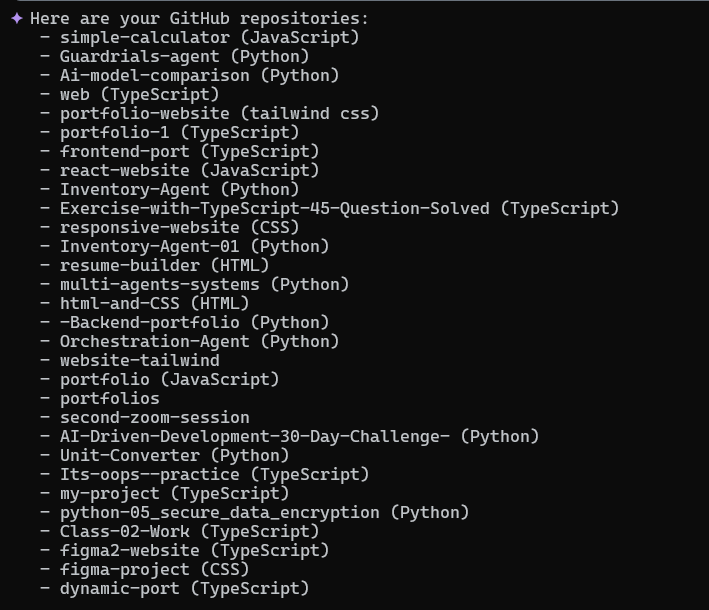

# 🧠 AI-Driven Development - 30-Day Challenge - Task-6
## 📚 Task 6 - Completed ✅

#  📌 Steps to Complete Task 6 (Easy Method)
### 🔹 Step 1 - Create Your GitHub Personal Access Token (PAT)

Generate a token with:
✔ repo (Read & Write)

## � Step 2 - Store Your Token Securely

Use GitHub Secrets to store your PAT securely in your repository settings.

### Store token in .env:
   

---

## 🔹Step 3 - Configure Gemini to Use GitHub MCP Server

create settings.json to connect mcp sever

### Settings.json File:
  

---

## 🔹 Step 4 - Start Command for Gemini-Cli


### Example Command to start:
```
gemini
```
---


##  � Step 5 - Verify Connection

### Run to Check Mcp/List:
```
command

/Mcp List
```
### Mcp List:
  


#### Results:
🟢 github — Ready (40+ tools)
If you see this → SUCCESS 

---
### 🔹 Step 6 - Test the Server

- List my GitHub repositories
- If Gemini shows your repos → MCP is fully connected ✔

### Github Repo list:
 

 ---

