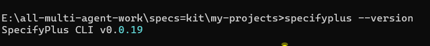
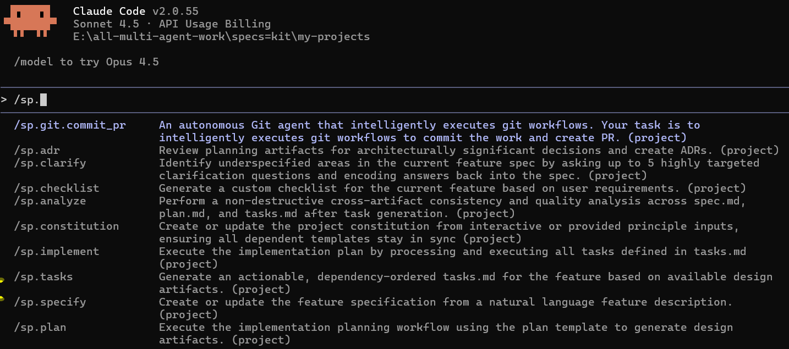

# 🧠 AI-Driven Development - 30-Day Challenge - Task-7

### What is SPECKIT PLUS?

SPECKit Plus aik chhota sa framework hai jo hamein project ko step-by-step plan karne, requirements likhne, tasks banane aur akhir me implement karne me help karta hai. Ye basically aik 5-step system hai jo idea ko “plan” se “complete project” tak le jata hai.

###  5. Core Concepts ✔️

### 1️⃣ /constitution :
/constitution project ka purpose, rules aur boundaries batata hai. Isme mission, responsibilities aur woh limits hoti hain jo project ko guide karti hain.

### 2️⃣ /specify :
/specify project ke goals ko clear aur measurable requirements me badalta hai, jisse pata chalta hai ke akhir me exactly kya deliver hona chahiye.

### 3️⃣ /plan : 
/plan project ka roadmap deta hai jisme timeline, milestones aur dependencies hote hain taake hamein pata ho kaam kab aur kaise complete hoga.

###  4️⃣ /tasks : 
/tasks project ko chhote, manageable tasks me todta hai jisse team members ko apna kaam samajhne aur complete karne me asani hoti hai.

###  5️⃣ /implement : 
/implement actual development aur execution phase hai jahan par project ko build kiya jata hai aur deliverables produce hote hain.

---

## 🛠️ Task-7 - SPECKIT PLUS Framework Implementation ✅
### Speckit Plus installation and Version : 
#### Installation:
```
pip install speckit-plus
```
#### Version:
```
specifyplus --version
```
---
### Version:

---
### Speckit-plus with Claude Code:



