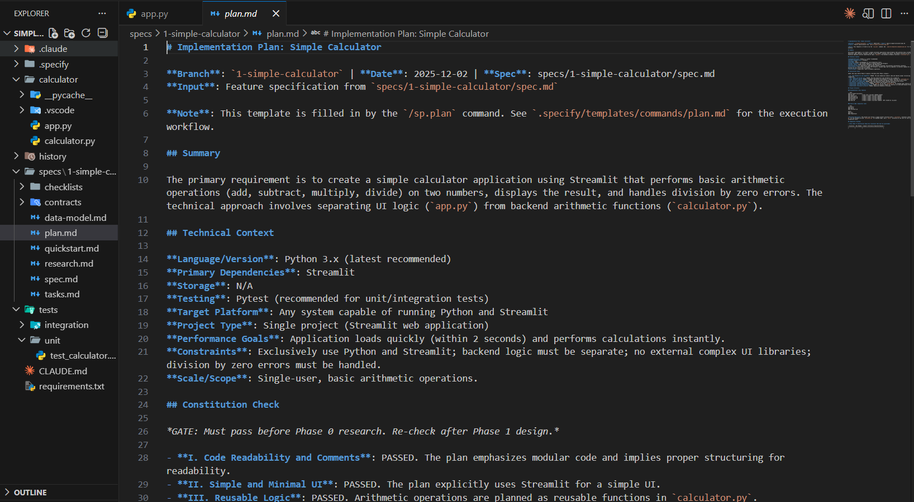
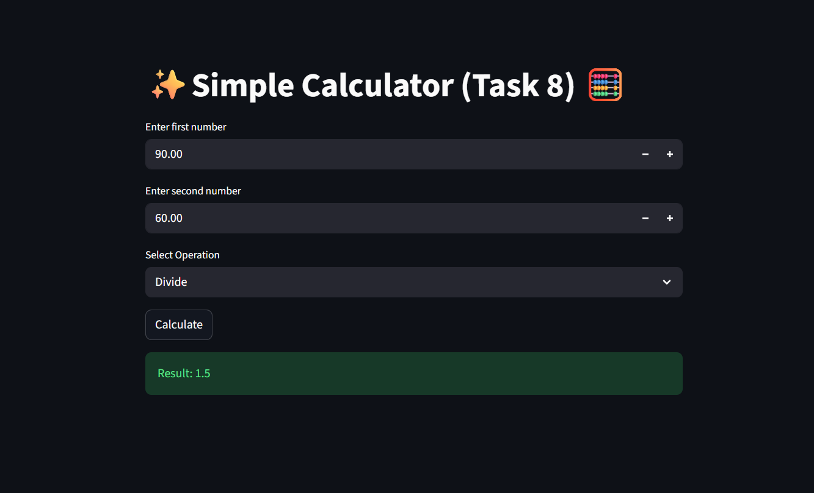

# 🧠 AI-Driven Development - 30-Day Challenge - Task-8

# Task 8 – Simple Calculator
**Framework:** Python + Streamlit  
**Project Management:** SPECKit Plus (5 Phases)

---

## 1️⃣ /constitution

### Project Purpose
Simple, clean aur fast calculator banane ke liye jo basic mathematical operations perform kare.

### Quality Principles
- Code readable aur clean hoga  
- UI simple aur minimal hoga (Streamlit)  
- Logic reusable functions me likha jayega  
- Calculator har operation me correct output dega  
- Error handling properly implement hogi

### Constraints
- Sirf Python & Streamlit use honge  
- Backend logic separate hoga  
- Koi external complex UI library nahi use hogi  
- Division by zero error allowed nahi hoga

---

## 2️⃣ /specify

### Functional Requirements
- Do number input lega  
- Char operations perform karega: Add, Subtract, Multiply, Divide  
- Result Streamlit UI per show kare  
- Divide by zero error handle karega

### Non-Functional Requirements
- App fast load hoga  
- UI clean aur user-friendly  
- Code modular hoga

### User Flow
1. User 1st number enter karega  
2. User 2nd number enter karega  
3. Operation choose karega  
4. "Calculate" button press karega  
5. Result show hoga

---

## 3️⃣ /plan

### File Structure
calculator-app/
├── app.py
└── calculator.py

### Development Plan
1. Streamlit install  
2. Backend logic write in calculator.py  
3. UI setup in app.py  
4. Operations connect with UI  
5. Test all cases  
6. Final cleanup and submission

---

## 4️⃣ /tasks

### Task List
1. Create project folder  
2. Create calculator.py  
3. Write functions for + - × ÷  
4. Create app.py  
5. Add Streamlit inputs  
6. Add operation selector  
7. Add calculate button  
8. Connect UI → backend logic  
9. Add error handling  
10. Test all operations  
11. Cleanup code  
12. Final deploy (optional)

---

## 5️⃣ /implement
this step for all task Implement...

###  1. Image ScreenShort:

---

###  2. Image ScreenShort:

---

###  3. Image ScreenShort:
